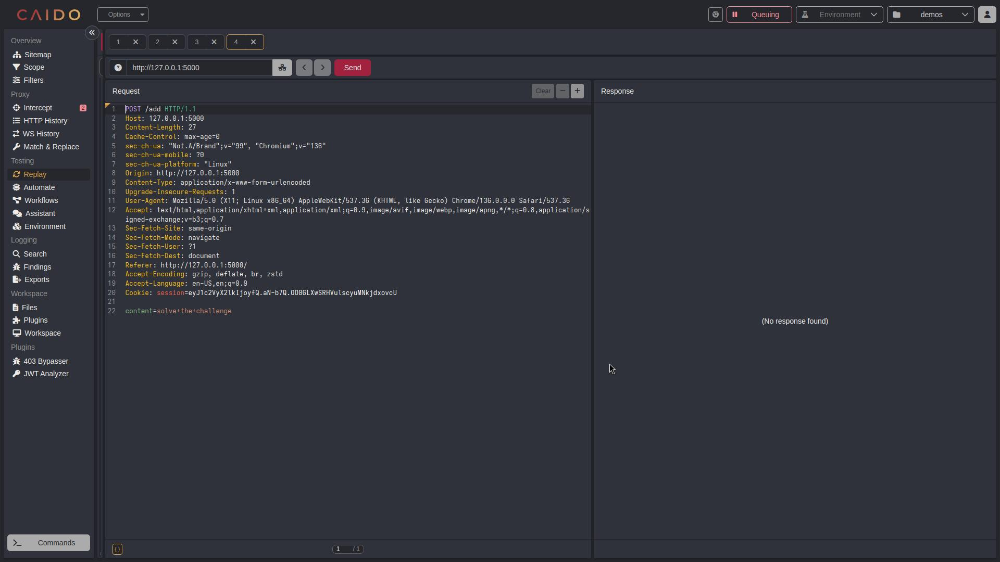
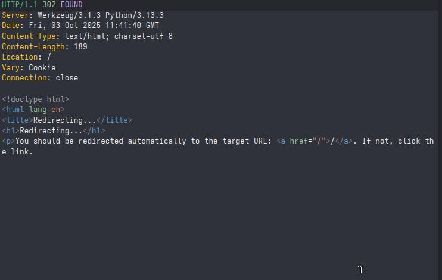

# Walkthrough: Exploiting IDOR

## 1. Running the Web Application

To run the web application on **Linux**, follow these steps:

    ```bash
    unzip demos.zip
    cd workjob
    cd IDOR
    pip install flask 
    python app.py
    ```
Or if you are on **windows** :

    extract the workjob folder from the demos.zip and open it in vscode ,
    with vscode open IDOR/app.py
    open a terminal (three dots in the top right => terminal => new terminal)
    and run pip install flaks then run the app.py either by python app.py or using the top left run button 
    now the app should be running , and this should appear 
    ```bash 
     * Serving Flask app 'app'
    * Debug mode: on
    WARNING: This is a development server. Do not use it in a production deployment. Use a production WSGI server instead.
    * Running on http://127.0.0.1:5000
    Press CTRL+C to quit
    * Restarting with stat
    * Debugger is active!
    * Debugger PIN: some number
    ```
## 2. Testing the Web Application
### 2.1 the victim's side
make a first account on the webapp, this will be the one whom we will perform an attack on (we will delete his note)
login to this account and make a note .

discover the webapp and test different functionalities

### 2.2 the attacker's side

#### 2.2.1 Setting up the proxy

before any hacking make sure to get comfortable a bit with bursuite https://www.youtube.com/watch?v=G3hpAeoZ4ek

or with caido https://www.youtube.com/watch?v=4rpbtc4nPAA

these are tutorials i reccomand, you can find ones that suit you better!

here i will be using caido but they work pertty sdimilarly so you can follow along with burp 

#### 2.2.2 Discovering the webapp 

Let's make a second account , the attacker's account, this will be the one we use to delete the todos.

let's make a todo with this account and see how the webapp behaves 

First make sure to be using the built-in browser from burp/caido , or running the proxy.

And also login to your account in the new browser. 

Second let's make a todo and intercept the request :
- turn on Queuing (intercept on in burp)


- write the todo and click add , back to caido you should see this popping up 


- let's add it to repeater using ctrl+r then navigating to the repeater you should see 




after clicking the send button you should see a 302 indicating success .
turn off queuing and go back to the browser you should see ur todo created.
let's test the delete functionality , the one we are interested in 
turn back on the queuing and click the delete button 
you should see this pop up again 


send the request to repeater using ctrl+r and let's try to test the functionality


we can see that we are sending a request to /delete/<id> (which would be the id of ur note that you requested to delete)
let's try changing that id to one of a different note , lets make it 1 for example, 
so the request should be now to /delete/1
hit send and voila ! the post is deleted 
if 1 didint work try 2,3 ... and send each time until you hit the jackpot and delete a todo




we can check that infact it was deleted by logging back in as the victim and checking


that worked in this case because :

1. there is no access control in the delete funciton 
2. the id is an AUTOINCREMENT INTEGER
```sql
CREATE TABLE IF NOT EXISTS todos (
    id INTEGER PRIMARY KEY AUTOINCREMENT,
    user_id INTEGER NOT NULL,
    content TEXT NOT NULL,
    completed BOOLEAN NOT NULL DEFAULT 0,
    created_at TIMESTAMP DEFAULT CURRENT_TIMESTAMP,
    FOREIGN KEY (user_id) REFERENCES users (id)
);
```
so the note ids will be 1 2 3 ..., which is easy to guess / bruteforce 

