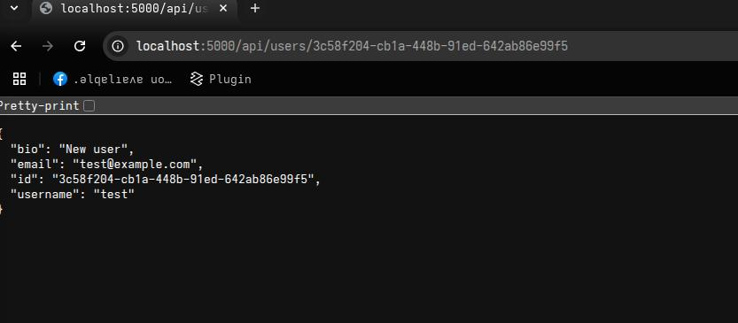

# Walkthrough: Exploiting IDOR2 (UUID-based)

> Target application: API that stores users in `users.db` and exposes these endpoints:
>
> * `POST /api/register` — create user
> * `POST /api/login` — create session
> * `GET /api/users` — list `id`, `username`
> * `GET /api/users/<user_id>` — get profile
> * `PUT /api/users/<user_id>` — update profile (email, bio)
> * `DELETE /api/users/<user_id>` — delete profile
> * `GET /api/users/me` — authenticated profile

---

## Goal (challenge)

1. Retrieve another user's information.
2. Modify that user's email or bio.
3. Delete that user's account.

---

## Prerequisites

* Python 3 installed
* `pip install flask` 
* A proxy tool (Burp or Caido) or Postman / curl
* The Flask app code saved as `IDOR/app.py`, run it like i specified in the first walkthrough

---
---

## 1. Run the application

```bash
# from the directory containing app.py
python app.py
```

You should see Flask start and the DB initialized. The `init_db()` function inserts three users (alice, bob, charlie) with UUIDs.
after that make two accounts one for the victim and one for the attacker.

this is my attacker's profile 


---

## 2. Quick overview of the vulnerability (boring details)

* **Intended design**: each user should only be able to view/update/delete their *own* record.

* **What's wrong**: the endpoints `GET /api/users/<user_id>`, `PUT /api/users/<user_id>`, and `DELETE /api/users/<user_id>` do *not* check whether the requestor is the owner of `user_id`.

* **Result**: Any client (even unauthenticated) can read, modify, or delete any user by providing their `user_id` — this is the classic **IDOR (Insecure Direct Object Reference)**.

Note: the `UUID` ids are harder to guess than simple integers,like the previous challenge, but the `/api/users` endpoint returns them (id + username), so we can know the id of the user pretty easily.

---

## 3. Reconnaissance: enumerate users

**Goal:** get a list of users and their UUIDs.

this one is simple: open a browser and visit http://127.0.0.1:5000/api/users


we can see that the victim's id , in our case here , is 3c58f204-cb1a-448b-91ed-642ab86e99f5
this will help us test different functionalities for misconfigurations.

## 4. Read victim's profile (GET)

**Goal:** retrieve target's profile JSON.

this one is also simple, since we have the identifier of the victim 

taking a look at the code we can see this :

```python 
@app.route('/api/users/<user_id>', methods=['GET'])
def api_get_user_profile(user_id):
    conn = get_db_connection()
    user = conn.execute("SELECT * FROM users WHERE id = ?", (user_id,)).fetchone()
    conn.close()
    
    if user:
        return jsonify({
            'id': user['id'],
            'username': user['username'],
            'email': user['email'],
            'bio': user['bio']
        })
    
    return jsonify({'error': 'User not found'}), 404
```
an endpoint (functionality) in the server that would give user info without checking who we are!
to exploit it (use it in our advantage)
open a browser and visit http://127.0.0.1:5000/api/users/<user_id>
and you will get info about him 





## 5. Modify victim's profile (PUT)

**Goal:** change the victim's email and bio.

since there is no authentication required in this buggy app , this also should be straightforward!

we will use caido here so get ready 

first access your profile in caido's browser (or burp as a explained previously)
turn on queuing (intercept in burp)  and hit the update profile button
this hsould appear in the Intercept


the request being made is /api/users/7327dec1-890f-479a-a77c-1d27bcaa9064
7327dec1-890f-479a-a77c-1d27bcaa9064 being our identifier , and request also has the data we wanan update 

```json
{
    "email":"bb@bb.bb",
    "bio":"New user"
}
```

let's send it to replay (repeater) and tinker with it a bit 
change the email and the bio field however you want and change the id from your to the victim's 


and click send and you should see the success message 


Check the victim’s profile again with GET to verify the change.


## 6. Delete victim's account (DELETE)

**Goal:** remove the victim from the database.

in the webapp we can see the delete functionality 
```python
@app.route('/api/users/<user_id>', methods=['DELETE'])
def api_delete_profile(user_id):
    conn = get_db_connection()
    user = conn.execute("SELECT * FROM users WHERE id = ?", (user_id,)).fetchone()
    
    if not user:
        conn.close()
        return jsonify({'error': 'User not found'}), 404
    
    conn.execute("DELETE FROM users WHERE id = ?", (user_id,))
    conn.commit()
    conn.close()
    
    if session.get('user_id') == user_id:
        session.clear()
    
    return jsonify({'message': 'User deleted successfully'})
```


exploiting this is similar to that update :
* go to the attacker profile 
* turn on interception / queuing
* hit delete account button 
* intercept the request , send it to repeater 
* change the id from your user id to the victim's 
* click send !

and that's it , the account should be deleted 
double check by trying to log back in with your victim's credentials, you would get an invalid credentials password if everything went well 
---


## 9. Why this is vulnerable

* **No auth checks**: The API allows unauthenticated manipulation of records.
* **Listing leaks UUIDs**: `/api/users` leaks the exact identifiers required to attack.

---

