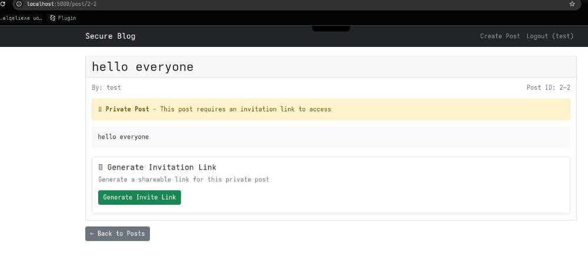
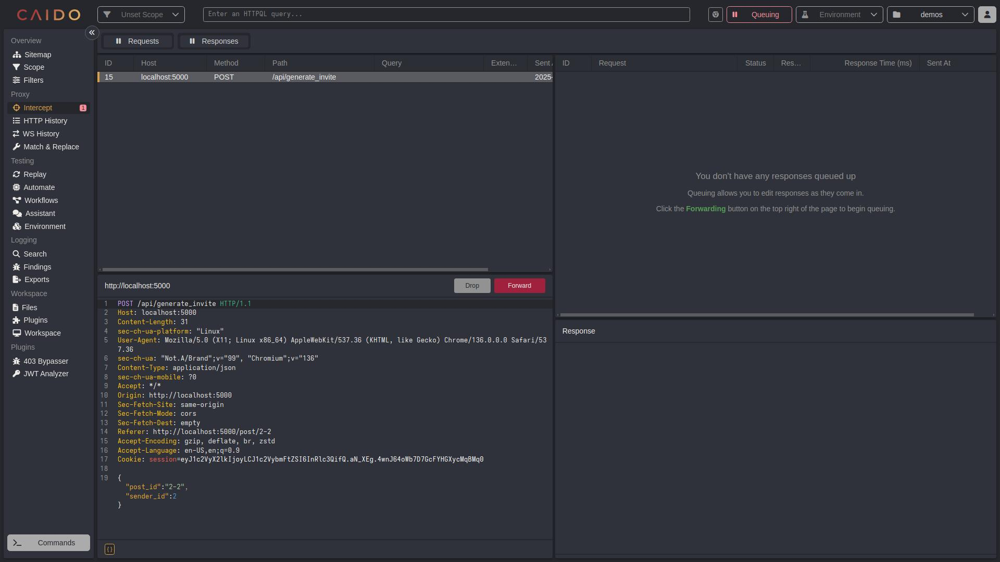
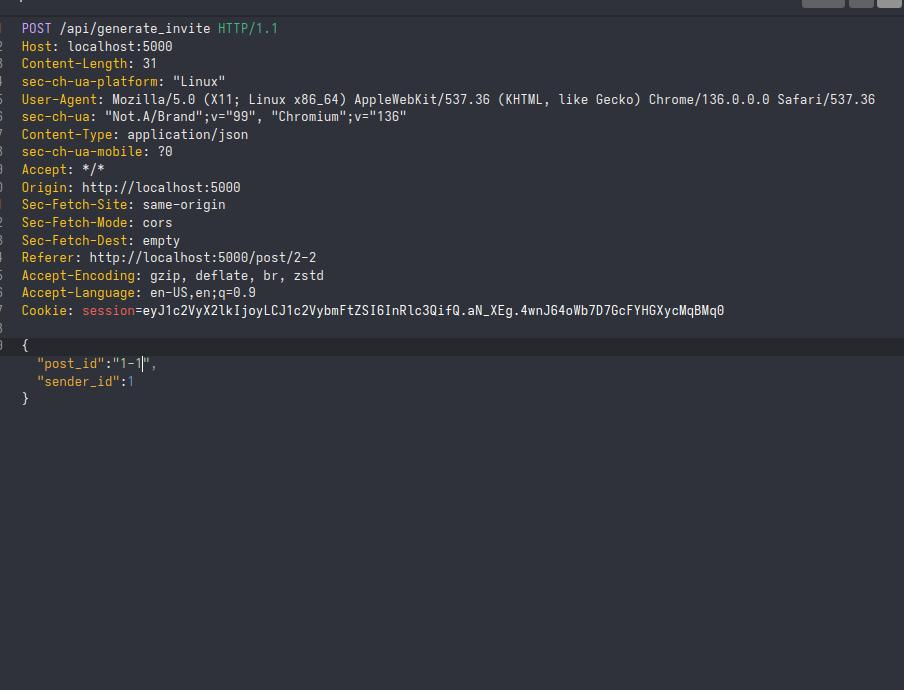
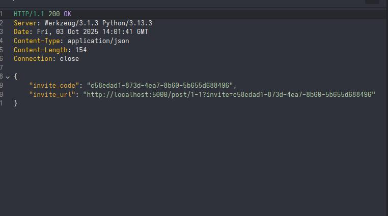

# Walkthrough: Exploiting IDOR3 
running the app is exactly like previous examples though you only need one account since the victim's account is already created 
## Goal (challenge)
out goal here is to see the note of the admin user.
## sidenote 
if the app doesnt wanna execute or is returning errors move this part of the code , in the init_db funciton , up :
```python
if os.path.exists(DATABASE):
        os.remove(DATABASE)
```
so this it would be like this 
```python 
def init_db():
    if os.path.exists(DATABASE):
        os.remove(DATABASE)
    conn = sqlite3.connect(DATABASE)
    c = conn.cursor()
    
    c.execute('''CREATE TABLE IF NOT EXISTS users
                 (id INTEGER PRIMARY KEY AUTOINCREMENT,
                  username TEXT UNIQUE,
                  password TEXT)''')
    ...
```
## Overview
### 1. post id
the post id in this application is in this form 
userId-IncrementalId
the userId part is , literally, the id of the user who made the post 
and the IncrementalId is the id of the note that belongs to the user 
so if a user of id 78 has 3 posts they would be 78-1,78-2 and 78-3 
if he adds another post it would have an id of 78-4
* note : User_id field is a simple autoincrement integer 

* conclusion : we need to access the note of id 1-1 , since the admin is the firsr created user and he will have a user_id of 1, and his first post would then have an id of 1-1
### 2. access control
we will do some code analisys to see how the app handles access control 

1. Explanation of `view_post`

```python
@app.route('/post/<post_id>')
def view_post(post_id):
```

* Defines a route `/post/<post_id>` handled by the `view_post` function.
* `<post_id>` is taken from the URL and passed to the function.

```python
    if 'user_id' not in session:
        return redirect(url_for('login'))
```

* Checks if the user is logged in (session contains `user_id`).
* If not, redirect to the login page.

```python
    conn = get_db()
    cursor = conn.cursor()
```

* Opens a database connection and creates a cursor for running SQL queries, to be able to search and get data from the database.

```python
    cursor.execute('''SELECT p.*, u.username 
                      FROM posts p 
                      JOIN users u ON p.user_id = u.id 
                      WHERE p.id = ?''', (post_id,))
    post = cursor.fetchone()
```

* Retrieves the post with the given `post_id` and the author’s username from the database by searching in the posts table for one with the id you (making the request) provided .
* `fetchone()` returns the matching row or `None`.

```python
    if not post:
        conn.close()
        return "Post not found", 404
```

* If no post exists, close DB connection and return **404 Not Found**.

```python
    if post['is_private']:
        if post['user_id'] != session['user_id']:
```

* If the post is marked private **and** the viewer is not the owner → extra checks required.

```python
            invite_code = request.args.get('invite')
```

* Reads an `invite` query parameter (e.g. `?invite=abc123`).

```python
            if invite_code:
                cursor.execute('''SELECT * FROM invitations 
                                WHERE code = ? AND post_id = ?''',
                             (invite_code, post_id))
                invite = cursor.fetchone()
                if not invite:
                    conn.close()
                    return "Invalid invite code", 403
```

* If an invite code is provided, verify it against the `invitations` table.
* If no valid invite found → return **403 Forbidden**.

```python
            else:
                conn.close()
                return "Private post - invite code required", 403
```

* If no invite code at all → deny access (403).

```python
    conn.close()
    return render_template('view_post.html', post=post)
```

* Close the DB connection.
* Render the `view_post.html` template with the post data.

---

👉 This function ensures:

* Only logged-in users can view posts.
* Public posts are viewable by anyone logged in.
* Viewing Private posts require either ownership or a valid invite code.

---
2. Explanation of `generate_invite`


```python
@app.route('/api/generate_invite', methods=['POST'])
def generate_invite():
```

* This makes a new functionality on the website called `/api/generate_invite`.
* When someone executes it (by sending a POST request), the `generate_invite` function runs.

---

```python
    if 'user_id' not in session:
        return jsonify({'error': 'Not authenticated'}), 401
```

* If you are **not logged in**, you can’t play.
* It sends back a message: *“You’re not allowed”*.

---

```python
    data = request.get_json()
    if not data or 'post_id' not in data or 'sender_id' not in data:
        return jsonify({'error': 'post_id and sender_id required'}), 400
```

* The function looks inside the request for **a little package of info** which corresponds to the info (data) you are sending to the web server.
* If the package doesn’t include which *post* (`post_id`) you wanna generate an invite for or which *sender* (`sender_id`) is making the invite, it says *“I can’t work with this”*.

---

```python
    post_id = data['post_id']
    sender_id = data['sender_id']
```

* Pulls the info (`post_id` and `sender_id`) out of the package to use them.

---

```python
    conn = get_db()
    cursor = conn.cursor()
    
    cursor.execute("SELECT * FROM posts WHERE id = ? and user_id=?", (post_id,sender_id))
    post = cursor.fetchone()
```

* Opens a door to the the database.
* Looks inside to see if the post with that identifier and belonging to the sender exists.
---

```python
    if not post:
        conn.close()
        return jsonify({'error': 'Post not found'}), 404
```

* If the post doesn’t exist, we close the database and say *“This post isn’t here”*.

---

```python
    invite_code = str(uuid.uuid4())
```

* Makes a brand-new **magic code** (like a secret password).
* Every time, it’s totally different and random.

---

```python
    try:
        cursor.execute("INSERT INTO invitations (code, post_id, sender_id) VALUES (?, ?, ?)",
                      (invite_code, post_id, sender_id))
        conn.commit()
        conn.close()
```

* Tries to put the **magic code** into the database, so it’s saved and remembered.
* this secret (invite code) corresponds to the post id and the sender id.
* Then closes it.

---

```python
        invite_url = f"{request.host_url}post/{post_id}?invite={invite_code}"
        return jsonify({'invite_code': invite_code, 'invite_url': invite_url})
```

* Builds a special **link** (invite_url) that looks like:
  `http://localhost.com/post/123?invite=magic-code`
* Gives this link back so you can share it with someone.

---

this is vulnerable because it let's anyone make an invite link for any post , public or private !

---

## Exploit 
since we need an invite code to access the desired post , we will make one!

let's make a request to the functionality that generates the invite codes , providing it with the desired post id (that we wanna view) and the admin's id (id=1)
as usual make sure you are opening the website in the browser of caido / burpsuite
to do that :


1. let's create a post and try to generate an invite for it 





click intercept and hit the 'generate invite link' button
now the request should appear in the Interpet 




as usual ctrl+r and send it to replay (repeater for burp)
we can see that the request being made is for the post with id 2-2 sent by the user of id 2
```json
{
    "post_id":"2-2",
    "sender_id":2
}
```
---

2. Performing the idor
change it to the one we wanna make an invite for , which is post of id 1-1 , and also change the sender-id 


```json
{
    "post_id":"1-1",
    "sender_id":1
}
```


click send and you should see a code being generated :



---
3. Finally 
now we have the code generated, we can access the invite url and see the private admin post that we weren't able to see prieviously!